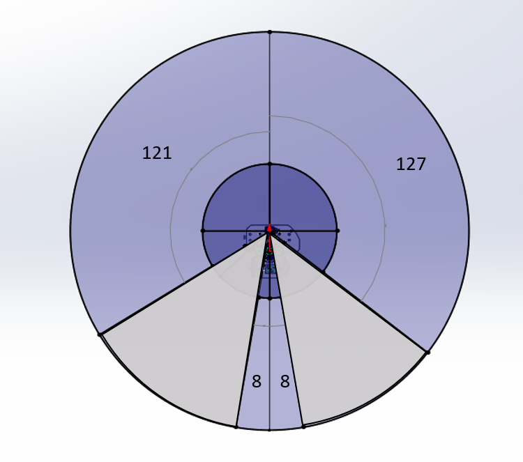

# quori_description 

 The ROS package for human interactive robot *Quori*.

## Prerequisites

The package is compatible with **Ubuntu 16.04** and **ROS Kinetic**, built with the **Catkin** system. Make sure you have the right environment configured.

You may need to get the following packages.  

## Joint Information
Approximate velocity limites are set in the urdf. The two joints, left_arm_lower_r1 and right_arm_lower_r1, are not actually controllable on the robot but are set manually.
 

### 1 Getting started

Clone and built this repo.

### 2 Microphone Array
The following package is used to interface with the ReSpeaker 2.0 microphone array
https://github.com/furushchev/respeaker_ros.git
More intformation about the ReSpeaker can be found at https://wiki.seeedstudio.com/ReSpeaker_Mic_Array_v2.0/
The joint origin for the sensor "head_Mic_joint" is simply at the center of the sensor.

### 3 Camera
The camera for Quori is the Orbbec Astra Mini which is mounted in the Duripod case.
The following package is used to interface with the sensor.
http://wiki.ros.org/astra_camera
http://shop.orbbec3d.com/Astra-Mini_p_40.html
http://shop.orbbec3d.com/DuriPOD_p_47.html

*FOV:* 60°H x 49.5°V x 73°D
*Range:* 0.6m – 5m

The offset horization position of the RGB and depth FoV are not set in this urdf. This information is expected to be provided seperately. The joint origin for the camera "head_Camera_joint" is simply at the center of the camera case.

### 4 Laser Scanner
The base laser scanner is the RPLidar a1. The following package is used to interface with the sensor.
https://github.com/Slamtec/rplidar_ros.git
To account for the FoV shadows of internal obsticles in the robot a laser filter should be used. The following image shows the approximate FoV coverage for the sensor.
https://github.com/ros-perception/laser_filters.git

